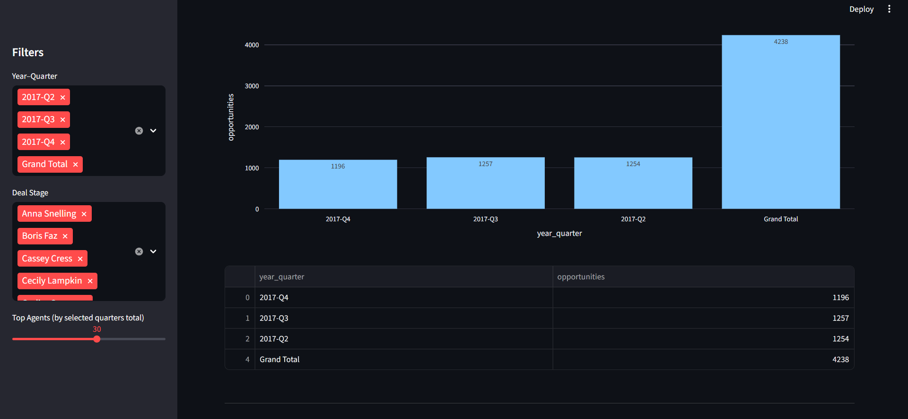
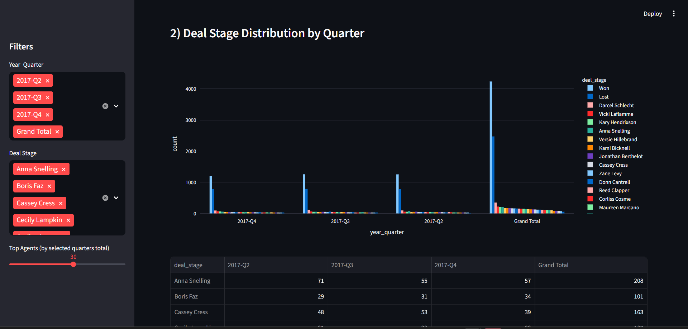
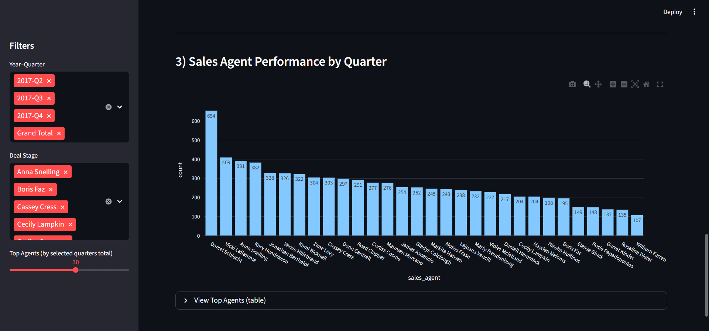
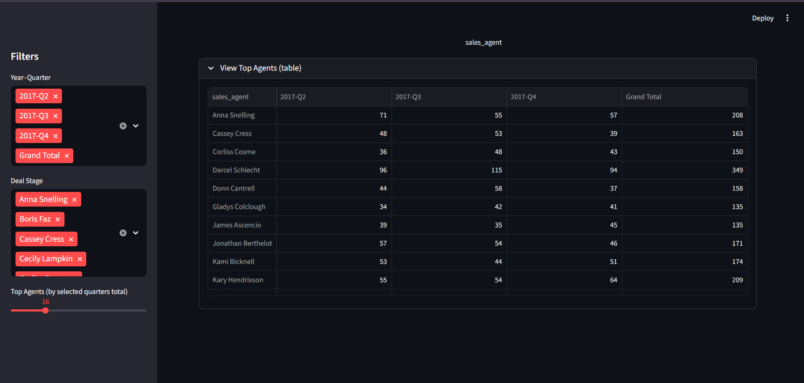

# CRM Sales Dashboard

An interactive **Streamlit** dashboard for exploring a CRM sales pipeline — opportunity
volume by quarter, won/lost distribution, and sales-agent performance — built on the
Maven Analytics *CRM Sales Opportunities* dataset.


## Features

- **KPI summary** — total opportunities, deals won, and deals lost for the selected quarters.
- **Opportunities by quarter** — deal volume across 2017 quarters, with a supporting table.
- **Deal-stage distribution** — won vs lost broken down by quarter.
- **Sales-agent performance** — reps ranked by deal count, with a detailed per-quarter table.
- **Interactive filters** — slice the views by year-quarter, deal stage, and number of top agents.

## Screenshots

| | |
| --- | --- |
|  |  |
|  |  |

## Tech stack

- **Python** — data handling with pandas
- **Streamlit** — app framework and layout
- **Plotly** — interactive charts

## Getting started

```bash
python -m venv .venv
source .venv/bin/activate          # Windows: .venv\Scripts\activate
pip install -r requirements.txt
streamlit run app.py
```

The app opens at http://localhost:8501.

## Data

Built on the Maven Analytics *CRM Sales Opportunities* dataset — B2B sales-pipeline data
for a fictitious company that sells computer hardware, covering sales opportunities,
products, accounts, and sales teams.

## Data source

[Maven Analytics Data Playground — CRM Sales Opportunities](https://mavenanalytics.io/data-playground/crm-sales-opportunities)